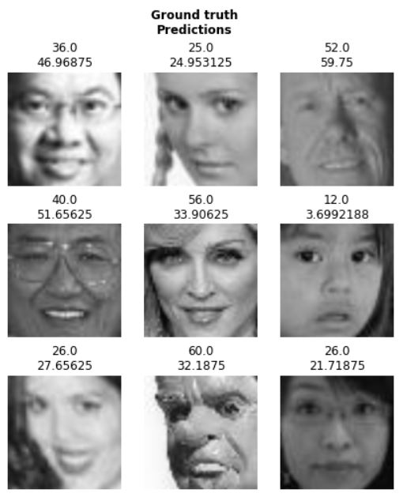

# WPI-DS541-Face-Age-Estimation
The course competition created by prof. Jake Whitehill (CS/DS541 2021). Task: To estimate ages of people from the gray-scale faces dataset. 
Approach: using [Fast.AI](https://docs.fast.ai/) library to build ResNet34 encoder followed by AdaptiveConcatPool2d() and GELU activation in a fully-connected layer.   

The examples of model predictions are shown below.

